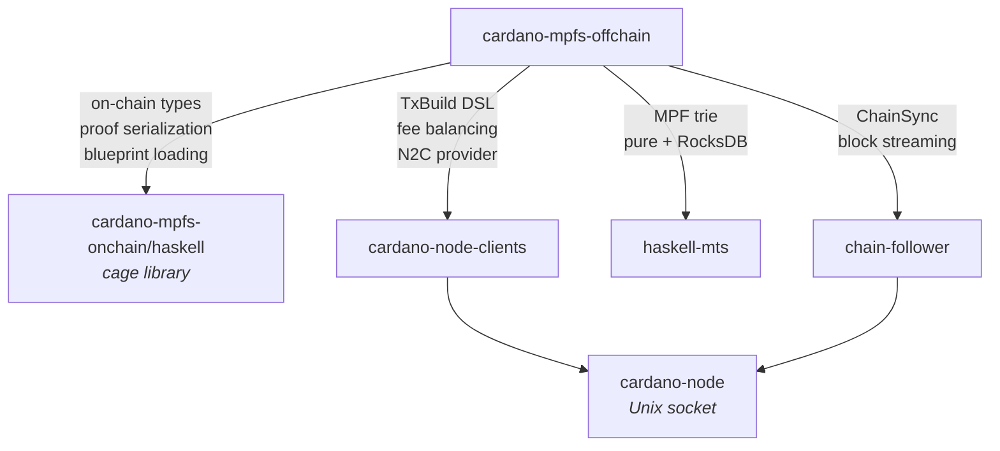

# cardano-mpfs-offchain

Off-chain service for
[cardano-mpfs-onchain](https://github.com/cardano-foundation/cardano-mpfs-onchain)
--- indexing, transaction building, and HTTP API for Cardano Merkle
Patricia Forestry.

Connects to a Cardano node via N2C, indexes cage UTxOs into RocksDB,
and exposes a REST API for building and submitting cage transactions.

## Dependencies



- **[cardano-mpfs-onchain/haskell](https://github.com/cardano-foundation/cardano-mpfs-onchain/tree/main/haskell)** ---
  canonical Haskell types matching the Aiken validator (`CageDatum`, `UpdateRedeemer`, `RequestAction`, `ProofStep`),
  MPF proof serialization, CIP-57 blueprint parsing, and asset-name derivation.
  The offchain re-exports these via `Core.OnChain`, `Core.Proof`, and `Core.Blueprint`.

- **[cardano-node-clients](https://github.com/lambdasistemi/cardano-node-clients)** ---
  operational-monad DSL for building transactions with convergent fee balancing (`Tx.build` + `Peek`),
  N2C `Provider` (UTxO queries, protocol params, script evaluation, slot conversion),
  and `Submitter` (LocalTxSubmission).

- **[haskell-mts](https://github.com/lambdasistemi/haskell-mts)** ---
  16-ary hex Merkle Patricia Forestry trie with Blake2b-256 hashing.
  Pure in-memory backend for testing, RocksDB backend for production.
  Proof generation compatible with the
  [Aiken MPF library](https://github.com/aiken-lang/merkle-patricia-forestry).

- **[chain-follower](https://github.com/lambdasistemi/chain-follower)** ---
  ChainSync protocol client that streams blocks from a Cardano node.
  The offchain's `CageFollower` processes each block in a single atomic
  RocksDB transaction.

## HTTP API

Servant REST API wrapping the internal `Context` record-of-functions.
External signing model --- the API returns unsigned CBOR-encoded
transactions; the client signs and submits via `POST /tx/submit`.

| Method | Endpoint | Description |
|--------|----------|-------------|
| GET | `/status` | Chain tip and checkpoint |
| GET | `/tokens` | Enumerate token UTxOs with completeness witness |
| GET | `/tokens/:id` | Token state |
| GET | `/tokens/:id/root` | Trie root hash |
| GET | `/tokens/:id/facts` | Enumerate facts with witnessed state |
| GET | `/tokens/:id/facts/:key` | Value lookup |
| GET | `/tokens/:id/proofs/:key` | Merkle proof |
| GET | `/tokens/:id/requests` | Pending requests with completeness witness |
| GET | `/tx/:txId?timeout=30` | Block until tx is indexed |
| POST | `/facts/boot` | Return boot facts for wallet-side transaction construction |
| POST | `/facts/request/insert` | Return insert-request facts for wallet-side transaction construction |
| POST | `/facts/request/delete` | Return delete-request facts for wallet-side transaction construction |
| POST | `/facts/end` | Return end facts for wallet-side transaction construction |
| POST | `/tx/update` | Build update transaction |
| POST | `/tx/retract` | Build retract transaction |
| POST | `/tx/submit` | Submit signed transaction |

Swagger UI is served at `/swagger-ui`.

## Verification client

The `cardano-mpfs-client` package (under `cardano-mpfs-client/`) is the
canonical consumer of the proof-bearing responses. Its library exposes
`verifyVerificationSnapshot` and its `mpfs-verify` CLI reads a JSON
response from a file or stdin and prints pass/fail with the baked-in
`utxo_root` and `chainpoint`:

```bash
curl -s https://host/status | cabal run mpfs-verify
```

Further verifier entry points are added alongside the response shapes
they consume as the proof-carrying slices land.

## Building

```bash
nix develop
just build
just unit            # unit tests via nix run .#unit-tests
just unit-offchain   # same unit-test flake app
just e2e             # E2E tests via nix run .#e2e-tests
just update-swagger  # regenerate docs/assets/swagger.json
```

## Documentation

https://lambdasistemi.github.io/cardano-mpfs-offchain/
