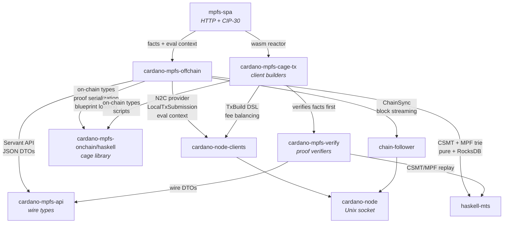

# cardano-mpfs-offchain

Off-chain service for
[cardano-mpfs-onchain](https://github.com/cardano-foundation/cardano-mpfs-onchain)
--- indexing, proof-bearing facts, and HTTP API for Cardano Merkle
Patricia Forestry.

Connects to a Cardano node via N2C, indexes cage UTxOs into RocksDB,
and exposes a trust-minimized REST API. The server is a fact provider:
it serves indexed snapshots, UTxOs with CSMT proofs, MPF facts, request
sets, and ledger evaluation metadata. Clients verify those facts, build
transactions locally, sign with their wallet, and submit signed CBOR via
`POST /submit`.

The browser SPA is available at <https://umpfs.plutimus.com/spa/>. It
uses HTTP plus CIP-30 only; protocol logic runs inside the pure Haskell
wasm cage reactor, not in ad hoc browser code.

## Dependencies



- **[cardano-mpfs-onchain/haskell](https://github.com/cardano-foundation/cardano-mpfs-onchain/tree/main/haskell)** ---
  canonical Haskell types matching the Aiken validator (`CageDatum`, `UpdateRedeemer`, `RequestAction`, `ProofStep`),
  MPF proof serialization, CIP-57 blueprint parsing, and asset-name derivation.
  The offchain re-exports these via `Core.OnChain`, `Core.Proof`, and `Core.Blueprint`.

- **[cardano-node-clients](https://github.com/lambdasistemi/cardano-node-clients)** ---
  operational-monad DSL for local transaction construction and
  convergent fee balancing (`Tx.build` + `Peek`), N2C protocol
  parameters, script evaluation, slot conversion, and
  LocalTxSubmission. `LocalStateQuery` UTxO scans are not used on the
  proof-bearing write path; UTxO facts come from the indexed CSMT.

- **[haskell-mts](https://github.com/lambdasistemi/haskell-mts)** ---
  CSMT/MPF primitives: sparse UTxO set proofs, 16-ary Merkle Patricia
  Forestry with Blake2b-256 hashing, pure in-memory backends for tests,
  RocksDB-backed production storage, and proof generation compatible
  with the [Aiken MPF library](https://github.com/aiken-lang/merkle-patricia-forestry).

- **[chain-follower](https://github.com/lambdasistemi/chain-follower)** ---
  ChainSync protocol client that streams blocks from a Cardano node.
  The offchain's `CageFollower` processes each block in a single atomic
  RocksDB transaction.

- **`cardano-mpfs-verify`** ---
  pure cross-target verifier package. It exposes snapshot, facts, read,
  CSMT completeness, and MPF replay verifiers such as
  `verifyTokenState`, `verifyTokenFacts`, `verifyTokenRequests`, and
  `verify*Facts`. The same code is compiled native, wasm32-wasi, and
  GHC-JS.

- **`cardano-mpfs-cage-tx`** ---
  pure client-side cage transaction builders and the
  `mpfs-cage-reactor` executable. Script-bearing operations are
  `*WithEval` builders that consume verified facts plus
  `GET /eval-context` metadata and return local unsigned transactions
  for wallet signing.

## HTTP API

Servant REST API wrapping the internal `Context` record-of-functions.
The public model is facts-first: script-bearing write endpoints return
proof-bearing facts, never unsigned transaction CBOR. The browser and
other clients verify those facts, run the pure cage builder locally, add
wallet witnesses, and submit via `POST /submit`. The remaining
server-built transaction endpoint is the owner-only `/tx/sweep` cleanup
path.

| Method | Endpoint | Description |
|--------|----------|-------------|
| GET | `/status` | Chain tip and checkpoint |
| GET | `/eval-context` | Trusted interim PlutusV3 PParams, cost models, SystemStart, and era-history for wallet-side ex-unit evaluation |
| GET | `/tokens` | Enumerate token UTxOs with explicit `token_id` values and a completeness witness |
| GET | `/tokens/:id` | Token state with UTxO witness and verification snapshot |
| GET | `/tokens/:id/root` | Trie root hash |
| GET | `/tokens/:id/facts` | Enumerate facts with witnessed state |
| GET | `/tokens/:id/facts/:key` | Present fact value with state witness and MPF proof; absent keys currently return 404 |
| GET | `/tokens/:id/proofs/:key` | MPF proof for a key, including exclusion proofs used by `verifyFactAbsentFacts` |
| GET | `/tokens/:id/requests` | Pending requests with UTxO witnesses and request-set completeness |
| GET | `/utxo/root` | Current indexed UTxO-CSMT root |
| GET | `/utxo/:txId/:txIx` | Resolve an indexed UTxO |
| GET | `/utxo/:txId/:txIx/proof` | UTxO CSMT inclusion proof |
| GET | `/tx/:txId?timeout=30` | Block until tx is indexed |
| POST | `/facts/boot` | Return boot facts for wallet-side transaction construction |
| POST | `/facts/request/insert` | Return insert-request facts for wallet-side transaction construction |
| POST | `/facts/request/delete` | Return delete-request facts for wallet-side transaction construction |
| POST | `/facts/request/update` | Return update-request facts for wallet-side transaction construction |
| POST | `/facts/update` | Return update facts for an exact request subset; `requests: []` means catch-all |
| POST | `/facts/retract` | Return retract facts for a named request UTxO |
| POST | `/facts/reject` | Return reject facts for an exact request subset; `requests: []` means catch-all |
| POST | `/facts/end` | Return end facts for wallet-side transaction construction |
| POST | `/tx/sweep` | Build owner-only sweep transaction for non-legitimate UTxO cleanup |
| POST | `/submit` | Submit signed transaction CBOR |

`POST /facts/update` and `POST /facts/reject` accept
`requests: ["txid#ix", ...]` as a fail-closed subset. An omitted or
empty list is the catch-all mode. A non-empty list that does not match
processable/rejectable indexed requests fails instead of silently
changing the batch.

Swagger UI is served at `/swagger-ui`.

## Verification client

The `cardano-mpfs-verify` package is the pure verifier. It is carved out
from `cardano-mpfs-client` so the verification closure is free of IO,
networking, Servant, and HTTP client dependencies. `cardano-mpfs-client`
still re-exports the verifier surface for native clients.

Read-side verifiers include:

- `verifyTokenState` for `GET /tokens/:id`
- `verifyTokenFacts` for `GET /tokens/:id/facts`
- `verifyTokenRequests` for `GET /tokens/:id/requests`
- `verifyFactPresentFacts` and `verifyFactAbsentFacts` for key proofs

Facts-side verifiers include `verifyBootFacts`,
`verifyRequestInsertFacts`, `verifyRequestUpdateFacts`,
`verifyRequestDeleteFacts`, `verifyUpdateFacts`, `verifyRetractFacts`,
`verifyRejectFacts`, and `verifyEndFacts`.

The older `mpfs-verify` CLI in `cardano-mpfs-client` verifies the
snapshot carried by a proof-bearing JSON response:

```bash
curl -s https://host/status | cabal run mpfs-verify
```

For browser and cross-target use, the native/wasm reactors read JSON
envelopes on stdin and return deterministic one-line verdicts:
`mpfs-verify-reactor` verifies envelopes and `mpfs-cage-reactor` verifies
facts before building cage transactions.

## Current validator identity

The #62 bounded-refund validator cutover uses cage script hash
`ad0a8eeeec8b0a5ee9930be5d6ea2e80b285fc2f3e9675a13a392dd5`. The old
`c0f05a30...` exact-refund hash is legacy. The SPA and server both take
validator identity from the pinned `cardano-mpfs-onchain` blueprint so
the browser reactor and offchain indexer agree on state and per-cage
request validator addresses.

## Building

```bash
nix develop
just build
just unit            # unit tests via nix run .#unit-tests
just unit-offchain   # same unit-test flake app
just e2e             # E2E tests via nix run .#e2e-tests
just update-swagger  # regenerate docs/assets/swagger.json
```

## Documentation

https://lambdasistemi.github.io/cardano-mpfs-offchain/
