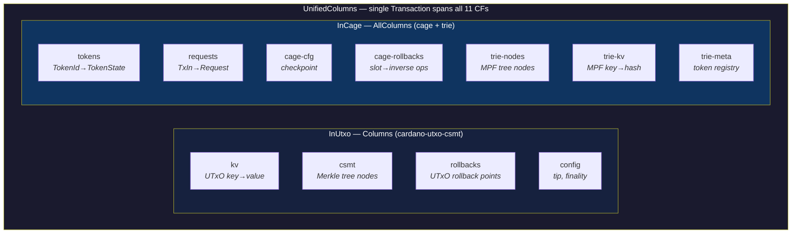
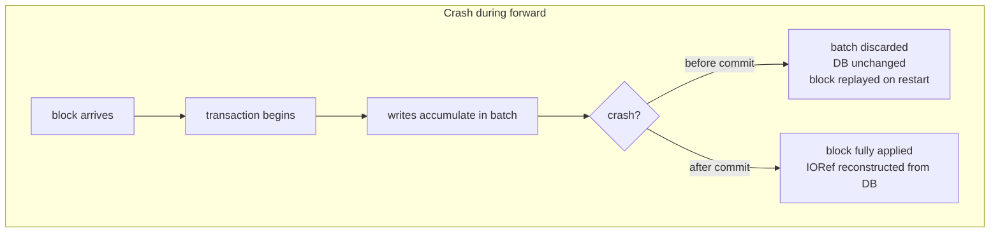
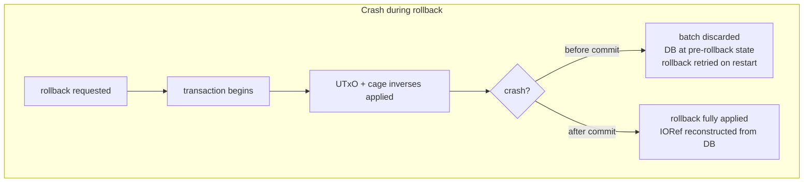
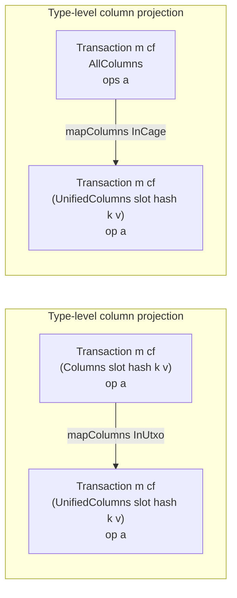
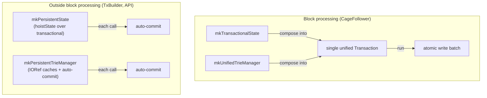

# Block Processing

## Invariant: One Block = One DB Transaction

Every block from ChainSync is processed in a **single atomic RocksDB
write batch**. All mutations — UTxO CSMT changes, cage state updates,
trie insertions/deletions, rollback inverse storage, and checkpoint
updates — either all commit or none do.

This guarantees that a crash at any point during block processing
leaves the database in a consistent state: either the block is fully
applied or not applied at all. The same invariant holds for rollback:
both UTxO and cage state are reverted in one atomic transaction.

## Column Layout

The database has 11 RocksDB column families. A `UnifiedColumns` GADT
addresses all of them through two sub-selectors:

Sub-transactions are lifted into the unified space with
`mapColumns InUtxo` and `mapColumns InCage`. The RocksDB write batch
accumulates all writes from both sub-selectors and commits them
atomically.

## Forward: Processing a Block

```mermaid
sequenceDiagram
    participant CS as ChainSync
    participant CF as CageFollower
    participant TX as Unified Transaction
    participant UTXO as InUtxo columns
    participant CAGE as InCage columns
    participant DB as RocksDB

    CS->>CF: rollForward (block, tip)
    Note over CF: extractConwayTxs (pure)<br/>compute utxoOps

    CF->>TX: run (begin transaction)

    rect rgb(30, 50, 80)
        Note over TX,CAGE: Step 1 — Detect cage events
        TX->>UTXO: resolveUtxoT (read KV column)
        UTXO-->>TX: spent TxOuts
        Note over TX: classify txs as cage events
    end

    rect rgb(30, 70, 50)
        Note over TX,CAGE: Step 2 — Apply cage mutations
        TX->>CAGE: applyCageBlockEvents<br/>(tokens, requests, trie inserts/deletes)
        CAGE-->>TX: inverse ops for rollback
    end

    rect rgb(30, 50, 80)
        Note over TX,UTXO: Step 3 — Forward UTxO CSMT
        TX->>UTXO: forwardTip<br/>(CSMT inserts/deletes + rollback point)
        UTXO-->>TX: stored? (bool)
    end

    rect rgb(30, 70, 50)
        Note over TX,CAGE: Step 4 — Persist rollback + checkpoint
        TX->>CAGE: storeRollbackT (slot, inverse ops)
        TX->>CAGE: putCheckpointT (slot, blockId, active slots)
    end

    TX->>DB: commit (atomic write batch)

    Note over CF: post-commit: IORef counter += 1
```

**Atomicity boundary**: everything inside `run $ do ...` is a single
`Transaction`. The write batch is committed when `run` returns. If
the process crashes at any point before `commit`, RocksDB discards
the batch and the block is never partially applied.

**Post-commit side effects** (outside the transaction):

- `IORef Int` rollback counter is bumped if `forwardTip` stored a new
  rollback point. This counter is advisory — it's reconstructed from
  the DB at startup via `countRollbackPoints`.

## Rollback: Reverting Blocks

Rollback is also atomic. Both UTxO and cage state are reverted in a
single transaction, guarded by the UTxO rollback result:

```mermaid
sequenceDiagram
    participant CS as ChainSync
    participant CF as CageFollower
    participant TX as Unified Transaction
    participant UTXO as InUtxo columns
    participant CAGE as InCage columns
    participant DB as RocksDB

    CS->>CF: rollBackward (point)

    CF->>TX: run (begin transaction)

    rect rgb(30, 50, 80)
        Note over TX,UTXO: Step 1 — Rollback UTxO CSMT
        TX->>UTXO: rollbackTip (apply inverse UTxO ops,<br/>delete rollback points after slot)
        UTXO-->>TX: (RollbackResult, deleted count)
    end

    alt RollbackSucceeded
        rect rgb(30, 70, 50)
            Note over TX,CAGE: Step 2 — Rollback cage state
            TX->>CAGE: rollbackToSlotT<br/>(replay cage inverses in reverse,<br/>delete cage rollback entries,<br/>update checkpoint)
        end
        TX->>DB: commit (atomic write batch)
        Note over CF: post-commit: IORef counter -= deleted
        CF-->>CS: Progress (continue following)
    else RollbackImpossible
        Note over TX: no cage rollback — keep consistent
        TX->>DB: commit (no-op write batch)
        CF->>UTXO: sampleRollbackPoints
        alt has rollback points
            CF-->>CS: Rewind (try different intersection)
        else no rollback points
            CF-->>CS: Reset (start from Origin)
        end
    end
```

**Key invariant**: cage rollback only runs when UTxO rollback
succeeds. This ensures both subsystems stay in sync. When rollback is
impossible (the target slot doesn't exist as a UTxO rollback point),
neither subsystem is modified — the follower instead resets the
ChainSync intersection.

## Crash Safety

The `IORef Int` rollback counter is the only mutable state outside
RocksDB. It is reconstructed at startup by scanning the rollback
points column (`countRollbackPoints`), so a crash never leaves it
permanently inconsistent.

## mapColumns Lifting

The `mapColumns` function from `rocksdb-kv-transactions` is the
mechanism that makes unified transactions possible:

Each sub-transaction reads and writes its own column families.
`mapColumns` lifts them into the unified namespace so they can be
sequenced inside a single `do` block and committed together.

## Bypassing the Update Continuation

The `cardano-utxo-csmt` library exports an `Update` record that wraps
`forwardTip` and `rollbackTip` with auto-commit and threads a
rollback point counter through continuations. The `CageFollower`
bypasses this:

- Calls `forwardTip` and `rollbackTip` directly (pure `Transaction`
  values, not auto-committing)
- Manages the rollback point counter via an `IORef Int`
- Handles `RollbackResult` (succeeded/impossible) itself

This is necessary because the `Update` continuation commits each
operation separately, violating the one-block-one-commit invariant.

## Transactional vs IO Layers

Records like `State` and `TrieManager` have two construction modes:

| Layer | Constructor | Monad | Used by |
|-------|-------------|-------|---------|
| Transactional | `mkTransactionalState` | `Transaction m cf AllColumns ops` | CageFollower |
| Transactional | `mkUnifiedTrieManager` | `Transaction m cf AllColumns ops` | CageFollower |
| IO | `mkPersistentState` | `IO` | TxBuilder, API |
| IO | `mkPersistentTrieManager` | `IO` | TxBuilder (speculative sessions) |

The transactional constructors compose into the caller's transaction
without committing. The IO constructors auto-commit each operation
(built via `hoistState` / natural transformation over the
transactional layer).

## Key Modules

| Module | Role |
|--------|------|
| [`Indexer.CageFollower`][s-cage-follower] | Unified `rollForward` / `rollBackward` |
| [`Indexer.Follower`][s-follower] | `detectCageBlockEvents`, `applyCageBlockEvents` |
| [`Indexer.Columns`][s-columns] | `UnifiedColumns` GADT (11 CFs) |
| [`Indexer.Rollback`][s-rollback] | `storeRollbackT`, `rollbackToSlotT` |
| [`Indexer.Persistent`][s-persistent] | `mkTransactionalState`, `mkPersistentState` |
| [`Trie.Persistent`][s-trie-pers] | `mkUnifiedTrieManager`, `mkPersistentTrieManager` |

[s-cage-follower]: https://github.com/paolino/cardano-mpfs-offchain/search?q=%22module+Cardano.MPFS.Indexer.CageFollower%22&type=code
[s-follower]: https://github.com/paolino/cardano-mpfs-offchain/search?q=%22module+Cardano.MPFS.Indexer.Follower%22&type=code
[s-columns]: https://github.com/paolino/cardano-mpfs-offchain/search?q=%22module+Cardano.MPFS.Indexer.Columns%22&type=code
[s-rollback]: https://github.com/paolino/cardano-mpfs-offchain/search?q=%22module+Cardano.MPFS.Indexer.Rollback%22&type=code
[s-persistent]: https://github.com/paolino/cardano-mpfs-offchain/search?q=%22module+Cardano.MPFS.Indexer.Persistent%22&type=code
[s-trie-pers]: https://github.com/paolino/cardano-mpfs-offchain/search?q=%22module+Cardano.MPFS.Trie.Persistent%22&type=code
