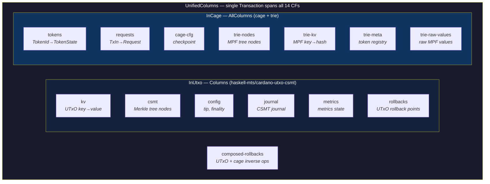
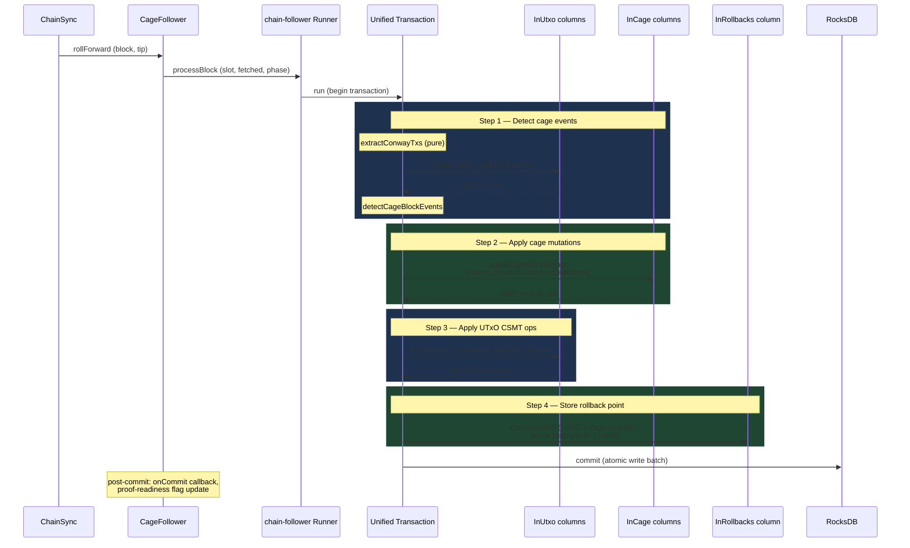
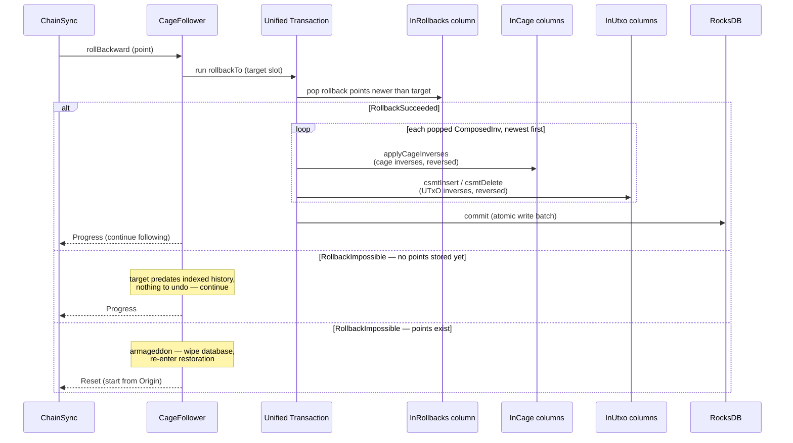
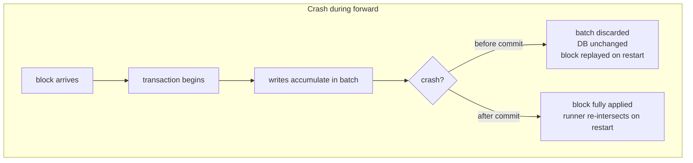
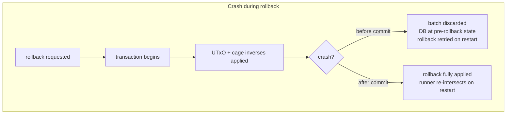
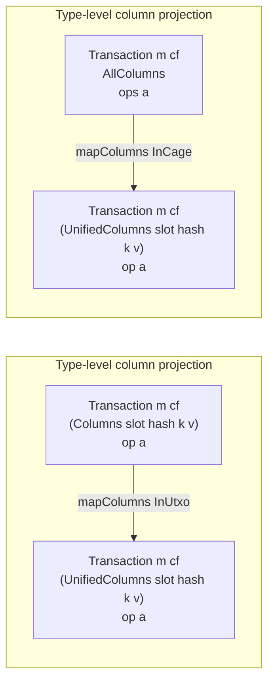
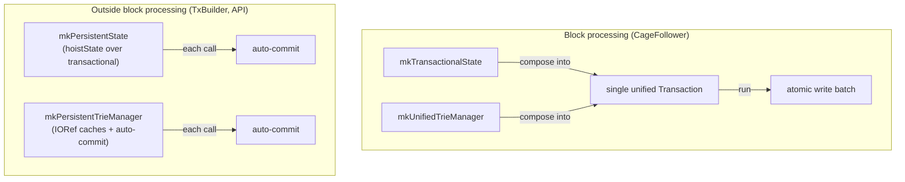

# Block Processing

## Invariant: One Block = One DB Transaction

Every block from ChainSync is processed in a **single atomic RocksDB
write batch**. All mutations — UTxO CSMT changes, cage state updates,
MPF trie insertions/deletions, rollback inverse storage, metrics, and
checkpoint updates — either all commit or none do.

This guarantees that a crash at any point during block processing
leaves the database in a consistent state: either the block is fully
applied or not applied at all. The same invariant holds for rollback:
both UTxO and cage state are reverted in one atomic transaction.

## Column Layout

The database has 14 RocksDB column families. A `UnifiedColumns` GADT
addresses them through two sub-selectors plus the composed
chain-follower rollback store:

```mermaid
graph TB
    subgraph unified["UnifiedColumns — single Transaction spans all 14 CFs"]
        direction LR
        subgraph utxo["InUtxo — Columns (haskell-mts/cardano-utxo-csmt)"]
            KV["kv<br/><i>UTxO key→value</i>"]
            CSMT["csmt<br/><i>Merkle tree nodes</i>"]
            CFG["config<br/><i>tip, finality</i>"]
            JOURNAL["journal<br/><i>CSMT journal</i>"]
            MET["metrics<br/><i>metrics state</i>"]
            RB["rollbacks<br/><i>UTxO rollback points</i>"]
        end
        subgraph cage["InCage — AllColumns (cage + trie)"]
            TOK["tokens<br/><i>TokenId→TokenState</i>"]
            REQ["requests<br/><i>TxIn→Request</i>"]
            CC["cage-cfg<br/><i>checkpoint</i>"]
            TN["trie-nodes<br/><i>MPF tree nodes</i>"]
            TKV["trie-kv<br/><i>MPF key→hash</i>"]
            TM["trie-meta<br/><i>token registry</i>"]
            TRV["trie-raw-values<br/><i>raw MPF values</i>"]
        end
        CR["composed-rollbacks<br/><i>UTxO + cage inverse ops</i>"]
    end

    style unified fill:#1a1a2e,color:#fff
    style utxo fill:#16213e,color:#fff
    style cage fill:#0f3460,color:#fff
```

Sub-transactions are lifted into the unified space with
`mapColumns InUtxo` and `mapColumns InCage`. The RocksDB write batch
accumulates all writes from both sub-selectors and the composed rollback
store, then commits atomically.

This same index serves the trust-minimized read API. `GET /tokens`,
`GET /tokens/:id`, `GET /tokens/:id/facts`, `GET
/tokens/:id/facts/:key`, `GET /tokens/:id/requests`, and `/utxo/*`
responses carry witnesses against one indexed `utxo_root` and chain
point. Handlers return a syncing/not-ready response while the CSMT is
being restored or transiently inconsistent, instead of reading from a
half-ready proof tree.

## Forward: Processing a Block

```mermaid
sequenceDiagram
    participant CS as ChainSync
    participant CF as CageFollower
    participant RUN as chain-follower Runner
    participant TX as Unified Transaction
    participant UTXO as InUtxo columns
    participant CAGE as InCage columns
    participant RB as InRollbacks column
    participant DB as RocksDB

    CS->>CF: rollForward (block, tip)
    CF->>RUN: processBlock (slot, fetched, phase)
    RUN->>TX: run (begin transaction)

    rect rgb(30, 50, 80)
        Note over TX,CAGE: Step 1 — Detect cage events
        Note over TX: extractConwayTxs (pure)
        TX->>UTXO: resolveUtxoT (read KV column)
        UTXO-->>TX: spent TxOuts
        Note over TX: detectCageBlockEvents
    end

    rect rgb(30, 70, 50)
        Note over TX,CAGE: Step 2 — Apply cage mutations
        TX->>CAGE: applyCageBlockEvents<br/>(tokens, requests, trie inserts/deletes)
        CAGE-->>TX: cage inverse ops
    end

    rect rgb(30, 50, 80)
        Note over TX,UTXO: Step 3 — Apply UTxO CSMT ops
        TX->>UTXO: csmtInsert / csmtDelete per block change
        UTXO-->>TX: UTxO inverse ops
    end

    rect rgb(30, 70, 50)
        Note over TX,RB: Step 4 — Store rollback point
        TX->>RB: ComposedInv (UTxO + cage inverses),<br/>prune history to k+1 points
    end

    TX->>DB: commit (atomic write batch)

    Note over CF: post-commit: onCommit callback,<br/>proof-readiness flag update
```

**Atomicity boundary**: everything inside `run $ do ...` is a single
`Transaction`. The write batch is committed when `run` returns. If
the process crashes at any point before `commit`, RocksDB discards
the batch and the block is never partially applied.

**Post-commit side effects** (outside the transaction):

- the `onCommit` callback fires (notifying waiters such as the
  `GET /tx/:txId` blocking endpoint), and
- the proof-readiness flag is updated from the runner phase, so proof
  endpoints answer "syncing" instead of reading a half-restored tree.

## Rollback: Reverting Blocks

Rollback is also atomic. Both UTxO and cage state are reverted in a
single transaction, guarded by the UTxO rollback result:

```mermaid
sequenceDiagram
    participant CS as ChainSync
    participant CF as CageFollower
    participant TX as Unified Transaction
    participant RB as InRollbacks column
    participant CAGE as InCage columns
    participant UTXO as InUtxo columns
    participant DB as RocksDB

    CS->>CF: rollBackward (point)

    CF->>TX: run rollbackTo (target slot)
    TX->>RB: pop rollback points newer than target

    alt RollbackSucceeded
        loop each popped ComposedInv, newest first
            TX->>CAGE: applyCageInverses<br/>(cage inverses, reversed)
            TX->>UTXO: csmtInsert / csmtDelete<br/>(UTxO inverses, reversed)
        end
        TX->>DB: commit (atomic write batch)
        CF-->>CS: Progress (continue following)
    else RollbackImpossible — no points stored yet
        Note over CF: target predates indexed history,<br/>nothing to undo — continue
        CF-->>CS: Progress
    else RollbackImpossible — points exist
        Note over CF: armageddon — wipe database,<br/>re-enter restoration
        CF-->>CS: Reset (start from Origin)
    end
```

**Key invariant**: a rollback either replays the stored `ComposedInv`
inverses — cage state first, then UTxO CSMT, each list in reverse
order — inside one atomic transaction, or it modifies nothing. When
the target slot is older than the retained rollback history, the
follower wipes the database (the armageddon action) and rebuilds from
Origin in restoration mode rather than guessing at an intermediate
state.

## Crash Safety

```mermaid
graph TD
    subgraph "Crash during forward"
        A["block arrives"] --> B["transaction begins"]
        B --> C["writes accumulate in batch"]
        C --> D{"crash?"}
        D -->|before commit| E["batch discarded<br/>DB unchanged<br/>block replayed on restart"]
        D -->|after commit| F["block fully applied<br/>runner re-intersects on restart"]
    end
```

```mermaid
graph TD
    subgraph "Crash during rollback"
        A["rollback requested"] --> B["transaction begins"]
        B --> C["UTxO + cage inverses applied"]
        C --> D{"crash?"}
        D -->|before commit| E["batch discarded<br/>DB at pre-rollback state<br/>rollback retried on restart"]
        D -->|after commit| F["rollback fully applied<br/>runner re-intersects on restart"]
    end
```

All indexer state lives in RocksDB. The runner phase
(restoration/following) is threaded through continuations — no
mutable counters exist outside the database — and on restart the
follower re-intersects ChainSync from the stored rollback points, so
a crash can never leave volatile state inconsistent with the
committed batch.

## mapColumns Lifting

The `mapColumns` function from `rocksdb-kv-transactions` is the
mechanism that makes unified transactions possible:

```mermaid
graph LR
    subgraph "Type-level column projection"
        T1["Transaction m cf<br/>(Columns slot hash k v)<br/>op a"]
        T2["Transaction m cf<br/>(UnifiedColumns slot hash k v)<br/>op a"]
        T1 -->|"mapColumns InUtxo"| T2
    end

    subgraph "Type-level column projection "
        T3["Transaction m cf<br/>AllColumns<br/>ops a"]
        T4["Transaction m cf<br/>(UnifiedColumns slot hash k v)<br/>op a"]
        T3 -->|"mapColumns InCage"| T4
    end
```

Each sub-transaction reads and writes its own column families.
`mapColumns` lifts them into the unified namespace so they can be
sequenced inside a single `do` block and committed together.

## Runner and Backend Composition

The block-processing machinery is split between this repository and
the `chain-follower` library:

- **`chain-follower` `Runner`** (`processBlock`, `rollbackTo`) owns
  the generic concerns: storing one `ComposedInv` rollback point per
  followed block in the `InRollbacks` column, pruning the history to
  `k + 1` points (the security parameter in blocks, see #355), and
  managing the phase transition between restoration and following
  (governed by the stability window in slots).
- **`Indexer.Backend.composedInit`** supplies the business logic as
  `restore` / `follow` / `applyInverse` callbacks: cage event
  detection, cage state and trie mutations, and UTxO CSMT operations.

During **restoration** (replaying blocks far from the tip) the
backend applies mutations without collecting inverses and runs the
CSMT in KVOnly mode; on the phase flip to **following**, `toFull`
replays the CSMT journal and subsequent blocks collect full
`ComposedInv` inverses. The cage checkpoint is derived from the
latest stored rollback point rather than written separately.

## Transactional vs IO Layers

Records like `State` and `TrieManager` have two construction modes:

```mermaid
graph TD
    subgraph "Block processing (CageFollower)"
        TS["mkTransactionalState"]
        TT["mkUnifiedTrieManager"]
        TS & TT -->|"compose into"| UTXN["single unified Transaction"]
        UTXN -->|"run"| WB["atomic write batch"]
    end

    subgraph "Outside block processing (TxBuilder, API)"
        PS["mkPersistentState<br/>(hoistState over transactional)"]
        PT["mkPersistentTrieManager<br/>(IORef caches + auto-commit)"]
        PS -->|"each call"| AC1["auto-commit"]
        PT -->|"each call"| AC2["auto-commit"]
    end
```

| Layer | Constructor | Monad | Used by |
|-------|-------------|-------|---------|
| Transactional | `mkTransactionalState` | `Transaction m cf AllColumns ops` | CageFollower |
| Transactional | `mkUnifiedTrieManager` | `Transaction m cf AllColumns ops` | CageFollower |
| IO | `mkPersistentState` | `IO` | TxBuilder, API |
| IO | `mkPersistentTrieManager` | `IO` | TxBuilder (speculative sessions) |

The transactional constructors compose into the caller's transaction
without committing. The IO constructors auto-commit each operation
(built via `hoistState` / natural transformation over the
transactional layer).

## Key Modules

| Module | Role |
|--------|------|
| [`Indexer.CageFollower`][s-cage-follower] | `rollForward` / `rollBackward` via the chain-follower `Runner` |
| [`Indexer.Backend`][s-backend] | `composedInit` — restore/follow/applyInverse callbacks |
| [`Indexer.Follower`][s-follower] | `detectCageBlockEvents`, `applyCageBlockEvents`, `applyCageInverses` |
| [`Indexer.ComposedInv`][s-composed-inv] | `ComposedInv` — combined UTxO + cage inverse ops |
| [`Indexer.Columns`][s-columns] | `UnifiedColumns` GADT (14 CFs) |
| [`Indexer.Persistent`][s-persistent] | `mkTransactionalState`, `mkPersistentState` |
| [`Trie.Persistent`][s-trie-pers] | `mkUnifiedTrieManager`, `mkPersistentTrieManager` |

[s-cage-follower]: https://github.com/lambdasistemi/cardano-mpfs-offchain/search?q=%22module+Cardano.MPFS.Indexer.CageFollower%22&type=code
[s-backend]: https://github.com/lambdasistemi/cardano-mpfs-offchain/search?q=%22module+Cardano.MPFS.Indexer.Backend%22&type=code
[s-follower]: https://github.com/lambdasistemi/cardano-mpfs-offchain/search?q=%22module+Cardano.MPFS.Indexer.Follower%22&type=code
[s-composed-inv]: https://github.com/lambdasistemi/cardano-mpfs-offchain/search?q=%22module+Cardano.MPFS.Indexer.ComposedInv%22&type=code
[s-columns]: https://github.com/lambdasistemi/cardano-mpfs-offchain/search?q=%22module+Cardano.MPFS.Indexer.Columns%22&type=code
[s-persistent]: https://github.com/lambdasistemi/cardano-mpfs-offchain/search?q=%22module+Cardano.MPFS.Indexer.Persistent%22&type=code
[s-trie-pers]: https://github.com/lambdasistemi/cardano-mpfs-offchain/search?q=%22module+Cardano.MPFS.Trie.Persistent%22&type=code
