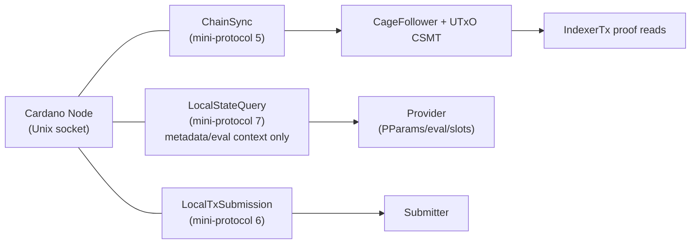
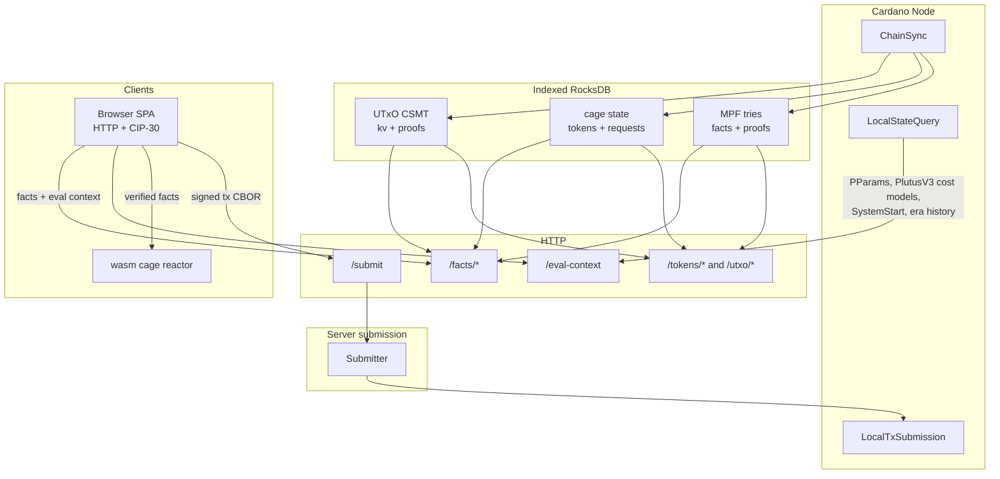

# Data Sources

All external data enters the system through a single Cardano node
socket. There is **no Ogmios, no Yaci Store** — only node-to-client
(N2C) Unix sockets carrying Cardano mini-protocols.

The public API is not a pass-through node query service. Proof-bearing
reads and facts endpoints are served from the local ChainSync-derived
RocksDB index: a UTxO CSMT plus cage state and MPF trie columns anchored
to one indexed snapshot. LocalStateQuery UTxO scans are forbidden on
production proof/write paths because they bypass that proof system.

## Connection

The service uses two N2C connections to the same node socket. Connection
1 runs ChainSync for the follower. Connection 2 runs LocalStateQuery and
LocalTxSubmission via `ouroboros-network` channels.

## Data Flow

## N2C Mini-Protocols

### ChainSync (protocol 5)

Streams blocks into the `CageFollower`, which processes UTxO changes,
cage events, MPF trie mutations, rollback storage, and checkpoints in a
single atomic RocksDB transaction. This is the source of truth for:

1. **UTxO facts** — indexed `TxIn -> TxOut` entries with CSMT inclusion
   proofs and prefix-completeness witnesses.
2. **Cage state** — token state UTxOs, request UTxOs, checkpoints, and
   rollback inverses.
3. **MPF facts** — per-token trie enumeration and inclusion/absence
   proofs generated by `haskell-mts`.

Handlers compose atomic reads through `Context.runIndexerTx`, so the
snapshot, UTxO witnesses, request-set witnesses, and MPF proofs in one
response target the same `utxo_root` and chain point.

### LocalStateQuery (protocol 7)

Queries node ledger metadata that is not yet trust-anchored by the
proof system. It is used for:

1. **Protocol parameters** — fee coefficients, max transaction size,
   minimum UTxO value, collateral percentage, Plutus execution prices.
   Queried via `GetCurrentPParams` (Conway era).

2. **Script evaluation and slot conversion** — used by native paths and
   exposed to the browser as `GET /eval-context`.

3. **Evaluation context** — `GET /eval-context` returns PlutusV3 cost
   models/protocol parameters, `SystemStart`, and live era-history so
   the pure reactor can evaluate ex-units and derive `EpochInfo`.

`GET /eval-context` is explicitly trusted and interim. Follow-up #311
will trust-anchor this metadata. Until then, tampering is expected to
fail local transaction construction or Phase 2 validation, but the
metadata itself is not proof-bearing.

`GetUTxOByAddress` is not a production facts source. It scans the node's
ledger UTxO set, has cost proportional to total chain UTxOs, and bypasses
the indexed CSMT proofs. Server-side proof and write handlers must use
the local index instead.

### LocalTxSubmission (protocol 6)

Submits a signed `Tx ConwayEra` to the node's mempool. The
Submitter converts the ledger transaction to a consensus `GenTx`
and returns either `Submitted txId` or `Rejected reason`.

The public route is `POST /submit`, which accepts signed transaction
CBOR. Script-bearing cage operations reach this route only after the
client verifies facts, runs the local cage builder/reactor, and adds
wallet witnesses.

## Channel Architecture

Communication between the N2C connection thread and the Provider /
Submitter uses `TBQueue`-backed channels:

- **`LSQChannel`** — carries `(query, resultVar)` pairs for protocol
  parameters, script evaluation, slot conversion, and eval-context
  metadata. It must not be used to source proof-bearing UTxO facts.
- **`LTxSChannel`** — carries `(genTx, resultVar)` pairs. The
  Submitter writes a transaction and blocks on the result MVar.

The N2C client thread reads from these queues and drives the
protocol state machines.

## ChainSync (Connection 1)

ChainSync (mini-protocol 5) runs on a **separate** N2C connection
from LSQ/LTxS, driven by `cardano-utxo-csmt`'s
`mkN2CChainSyncApplication`. Each block is handed to the
`CageFollower`, which processes UTxO changes, cage events, trie
mutations, and rollback storage in a single atomic RocksDB
transaction.

See [Block Processing](block-processing.md) for the full
forward/rollback flow.
