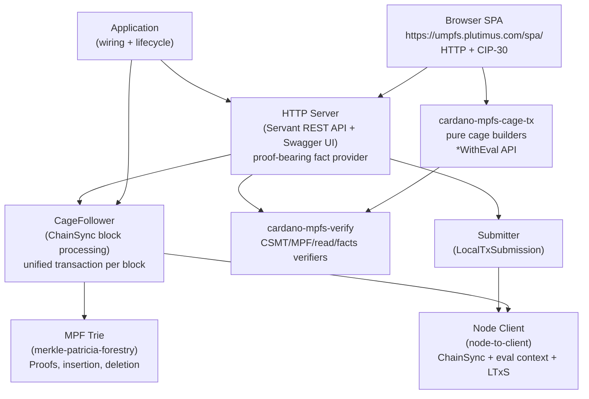
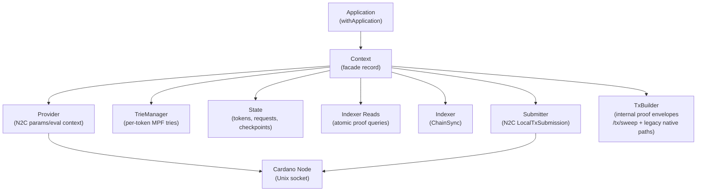
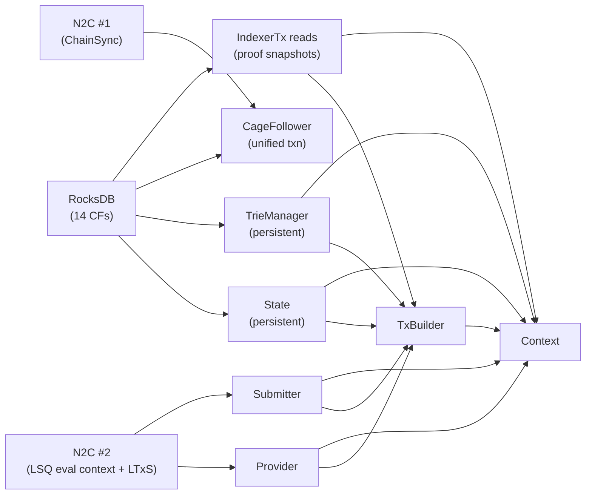
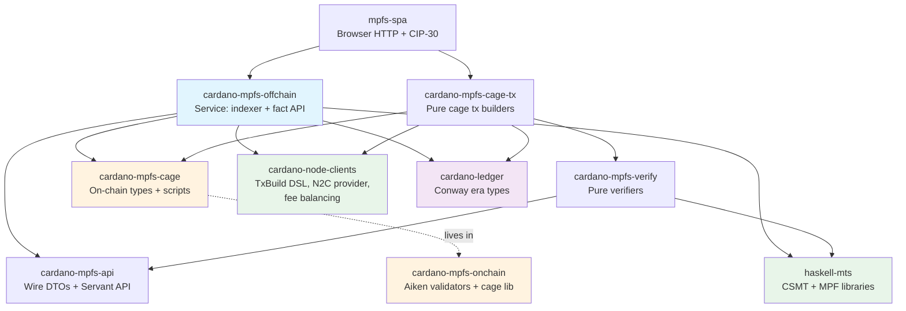
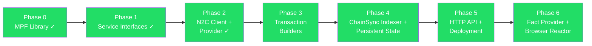

# Architecture Overview

## System Stack

The service connects to a Cardano node via two N2C connections:

1. **ChainSync** — blocks are processed by the `CageFollower`, which
   applies UTxO, cage state, and trie mutations in a single atomic
   RocksDB transaction per block (see
   [Block Processing](block-processing.md)).
2. **LocalStateQuery + LocalTxSubmission** — LocalTxSubmission sends
   signed transactions. LocalStateQuery is used for protocol parameters,
   script evaluation, slot conversion, and the trusted interim
   `GET /eval-context` metadata. It is not used as a public UTxO
   fact source.

The public write path is facts-first. The server returns proof-bearing
facts anchored to one indexed UTxO-CSMT snapshot; clients verify them
with `cardano-mpfs-verify`, run `cardano-mpfs-cage-tx` locally, sign
with wallet keys, and submit signed CBOR through `POST /submit`. The
server must not return unsigned transactions for script-bearing cage
operations. The remaining server-built transaction route is the
owner-only `/tx/sweep` cleanup path.

Read endpoints ship only **provable on-chain data plus proofs**:
witnessed UTxOs (`TxIn` + full `TxOut` + CSMT inclusion proof), the
completeness / MPF-replay proofs binding them to the snapshot's
`utxo_root`, and genuinely server-only data the client cannot derive
(the snapshot, chain tip, and `utxo_root`). They must **not** ship
server-side *projections* - parsed convenience JSON re-rendering data
already present in a witnessed `TxOut`. Projections are unverified,
frequently lossy, and tempt verifying clients into trusting
non-provable data. A client reconstructs everything it needs (token
id, token state, request payload) by decoding the inline datum of the
witnessed `TxOut`; the server's job is to provide that provable
material, not to interpret it.

`POST /submit` accepts **only MPFS operations**. Before relaying, the
server runs a cheap scope gate on the decoded tx. A transaction is
admitted when it touches the cage contract surface in any of these ways:

- it mints or burns the cage state-token policy (boot, end);
- it locks an output at the cage state address (boot, update, reject);
- it produces a request output — a `RequestDatum`-bearing output sitting
  at this cage's per-token request validator address
  (`requestAddrFromCfg` for the token named in the datum), so a crafted
  `RequestDatum` at any other script address is rejected (request
  create);
- it **spends** a cage-owned UTxO — the cage state UTxO or a request
  UTxO at a request validator address. This input-aware clause is what
  admits the spend-only operations **retract** and **sweep**, which
  refund or reclaim a request UTxO and so leave no cage mint and no cage
  output.

The mint and output checks are purely structural, but the spend check
needs the chain: the handler resolves the tx's spent inputs against the
indexer's UTxO set (one atomic read) and feeds the resolved `TxOut`s
into the pure predicate. The gate is conservative — an input the indexer
cannot resolve (its view may lag the chain) is treated as touching the
cage, so a valid operation is never false-rejected; only a transaction
that is definitely non-MPFS (no cage mint, no cage output, every spent
input resolved to a non-cage UTxO) — a plain ADA transfer, say — is
rejected, with a typed `400 "this service only submits MPFS
operations"`. This is abuse prevention at the gateway, not a new trust
boundary; the on-chain validators remain authoritative.

The 502 era-history failure was fixed by carrying live era history in
`GET /eval-context` and deriving `EpochInfo` from it in the reactor.
`ScriptContext` `POSIXTimeRange` costs now use the same era clock as the
node instead of a hardcoded clock.

## Singleton Dependency Graph

Every major component is a **record of functions** (no typeclasses).
Records are created bottom-up and torn down top-down using bracket
patterns.

## Application Wiring

`withApplication` creates and wires all components:

All components use real implementations backed by RocksDB and N2C
connections. The `CageFollower` runs on connection 1 (ChainSync),
processing each block in a single atomic transaction. The proof-bearing
HTTP handlers read through `Context.runIndexerTx`, composing snapshot,
UTxO, request-set, and MPF reads into a single underlying transaction.
The `Provider` uses connection 2 only for ledger metadata/evaluation;
`Submitter` uses it for LocalTxSubmission.

## External Dependencies

| Color | Meaning |
|-------|---------|
| Blue | This project |
| Blue-linked packages | Split local packages in this repository |
| Orange | On-chain repo (validators + cage library) |
| Green | lambdasistemi libraries |
| Purple | Cardano ecosystem dependencies |

The current #62 bounded-refund validator cutover uses cage script hash
`ad0a8eeeec8b0a5ee9930be5d6ea2e80b285fc2f3e9675a13a392dd5`. The old
`c0f05a30...` exact-refund hash is legacy and should not be used for
new preprod/browser flows.

## Module Hierarchy

The repository is split into several packages. The server lives in
`cardano-mpfs-offchain`; shared wire types live in `cardano-mpfs-api`;
pure verifiers live in `cardano-mpfs-verify`; pure cage builders live in
`cardano-mpfs-cage-tx`; native clients can consume the re-exporting
`cardano-mpfs-client`; and the browser UI lives in `mpfs-spa`.

The `cardano-mpfs-offchain` library is organized in layers. Server
modules live under `Cardano.MPFS`.

[search all modules]: https://github.com/lambdasistemi/cardano-mpfs-offchain/search?q=path%3Acardano-mpfs-offchain%2Flib+extension%3Ahs&type=code

### Core — domain types and pure logic

| Module | Purpose |
|--------|---------|
| [`Core.Types`][s-types] | `TokenId`, `Root`, `Request`, `TokenState`, `CageConfig` |
| [`Core.OnChain`][s-onchain] | Re-exports from [cage][cage-lib] + offchain-specific `cagePolicyId`, `cageAddr` |
| [`Core.Blueprint`][s-blueprint] | Re-exports from [cage][cage-lib]: blueprint loading, validation |
| [`Core.Proof`][s-proof] | Re-exports from [cage][cage-lib]: proof serialization |

[s-types]: https://github.com/lambdasistemi/cardano-mpfs-offchain/search?q=%22module+Cardano.MPFS.Core.Types%22&type=code
[s-onchain]: https://github.com/lambdasistemi/cardano-mpfs-offchain/search?q=%22module+Cardano.MPFS.Core.OnChain%22&type=code
[s-blueprint]: https://github.com/lambdasistemi/cardano-mpfs-offchain/search?q=%22module+Cardano.MPFS.Core.Blueprint%22&type=code
[s-proof]: https://github.com/lambdasistemi/cardano-mpfs-offchain/search?q=%22module+Cardano.MPFS.Core.Proof%22&type=code
[cage-lib]: https://github.com/cardano-foundation/cardano-mpfs-onchain/tree/main/haskell

### Interfaces — record-of-functions singletons

| Module | Purpose |
|--------|---------|
| [`Context`][s-context] | Facade bundling all singletons |
| [`Provider`][s-provider] | protocol params, evaluation, slot conversion, and trusted interim eval context support; LSQ UTxO queries are forbidden on proof/write hot paths |
| [`State`][s-state] | `Tokens`, `Requests`, `Checkpoints` sub-records |
| [`Trie`][s-trie] | `TrieManager` — per-token MPF trie access |
| [`TxBuilder`][s-txbuilder] | internal proof-envelope builders and `/tx/sweep`; browser-facing script-bearing transactions are built client-side from facts |
| [`Indexer`][s-indexer] | Chain follower lifecycle (`start`, `stop`, `getTip`) |
| [`Submitter`][s-submitter] | `submitTx :: Tx ConwayEra -> m SubmitResult` |
| [`Application`][s-application] | `withApplication` — wiring and lifecycle |

[s-context]: https://github.com/lambdasistemi/cardano-mpfs-offchain/search?q=%22module+Cardano.MPFS.Context%22&type=code
[s-provider]: https://github.com/lambdasistemi/cardano-mpfs-offchain/search?q=%22module+Cardano.MPFS.Provider%22+path%3Alib%2FCardano%2FMPFS%2FProvider.hs&type=code
[s-state]: https://github.com/lambdasistemi/cardano-mpfs-offchain/search?q=%22module+Cardano.MPFS.State%22&type=code
[s-trie]: https://github.com/lambdasistemi/cardano-mpfs-offchain/search?q=%22module+Cardano.MPFS.Trie%22+path%3Alib%2FCardano%2FMPFS%2FTrie.hs&type=code
[s-txbuilder]: https://github.com/lambdasistemi/cardano-mpfs-offchain/search?q=%22module+Cardano.MPFS.TxBuilder%22+path%3Alib%2FCardano%2FMPFS%2FTxBuilder.hs&type=code
[s-indexer]: https://github.com/lambdasistemi/cardano-mpfs-offchain/search?q=%22module+Cardano.MPFS.Indexer%22+path%3Alib%2FCardano%2FMPFS%2FIndexer.hs&type=code
[s-submitter]: https://github.com/lambdasistemi/cardano-mpfs-offchain/search?q=%22module+Cardano.MPFS.Submitter%22+path%3Alib%2FCardano%2FMPFS%2FSubmitter.hs&type=code
[s-application]: https://github.com/lambdasistemi/cardano-mpfs-offchain/search?q=%22module+Cardano.MPFS.Application%22&type=code

### HTTP — REST API

| Module | Purpose |
|--------|---------|
| [`HTTP.API`][s-http-api] | Server-local API wrapper around shared Servant API plus metrics |
| [`HTTP.Types`][s-http-types] | Server compatibility re-exports and ledger conversion helpers |
| [`HTTP.Encoding`][s-http-enc] | `Hex` newtype for binary-as-hex transport |
| [`HTTP.Server`][s-http-server] | WAI application wiring, `mkApp` |
| [`HTTP.Swagger`][s-http-swagger] | OpenAPI spec generation, Swagger UI |

The shared API and DTO definitions live in `cardano-mpfs-api`:

| Package module | Purpose |
|----------------|---------|
| `Cardano.MPFS.API` | Canonical Servant API: `GET /eval-context`, proof-bearing reads, facts endpoints, `/tx/sweep`, `/submit` |
| `Cardano.MPFS.API.Types` | Status, token, request, read-response, submit, and sweep JSON types |
| `Cardano.MPFS.API.Types.Facts` | Facts-only response types for boot/request/update/retract/reject/end |
| `Cardano.MPFS.API.Types.Common` | Shared snapshot, UTxO witness, token id, and eval-context primitives |

[s-http-api]: https://github.com/lambdasistemi/cardano-mpfs-offchain/search?q=%22module+Cardano.MPFS.HTTP.API%22&type=code
[s-http-types]: https://github.com/lambdasistemi/cardano-mpfs-offchain/search?q=%22module+Cardano.MPFS.HTTP.Types%22&type=code
[s-http-enc]: https://github.com/lambdasistemi/cardano-mpfs-offchain/search?q=%22module+Cardano.MPFS.HTTP.Encoding%22&type=code
[s-http-server]: https://github.com/lambdasistemi/cardano-mpfs-offchain/search?q=%22module+Cardano.MPFS.HTTP.Server%22&type=code
[s-http-swagger]: https://github.com/lambdasistemi/cardano-mpfs-offchain/search?q=%22module+Cardano.MPFS.HTTP.Swagger%22&type=code

### Indexer — chain sync and persistence

| Module | Purpose |
|--------|---------|
| [`Indexer.CageFollower`][s-idx-cage] | Unified `rollForward`/`rollBackward` — [one block = one transaction](block-processing.md) |
| [`Indexer.Event`][s-idx-event] | [`detectCageEvents`][s-detect] — cage tx classification |
| [`Indexer.Follower`][s-idx-follower] | `detectCageBlockEvents`, `applyCageBlockEvents` — generic over `Monad m` |
| [`Indexer.Persistent`][s-idx-persist] | `mkTransactionalState` (composable) + `mkPersistentState` (IO) |
| [`Indexer.Columns`][s-idx-columns] | [`AllColumns`][s-allcolumns] + [`UnifiedColumns`][s-unifiedcols] GADTs — full DB schema |
| [`Indexer.Codecs`][s-idx-codecs] | CBOR serialization for column key-value types |
| [`Indexer.Rollback`][s-idx-rollback] | `storeRollbackT`, `rollbackToSlotT` — transactional rollback |

[s-idx-cage]: https://github.com/lambdasistemi/cardano-mpfs-offchain/search?q=%22module+Cardano.MPFS.Indexer.CageFollower%22&type=code
[s-idx-event]: https://github.com/lambdasistemi/cardano-mpfs-offchain/search?q=%22module+Cardano.MPFS.Indexer.Event%22&type=code
[s-detect]: https://github.com/lambdasistemi/cardano-mpfs-offchain/search?q=detectCageEvents&type=code
[s-idx-follower]: https://github.com/lambdasistemi/cardano-mpfs-offchain/search?q=%22module+Cardano.MPFS.Indexer.Follower%22&type=code
[s-idx-persist]: https://github.com/lambdasistemi/cardano-mpfs-offchain/search?q=%22module+Cardano.MPFS.Indexer.Persistent%22&type=code
[s-idx-columns]: https://github.com/lambdasistemi/cardano-mpfs-offchain/search?q=%22module+Cardano.MPFS.Indexer.Columns%22&type=code
[s-allcolumns]: https://github.com/lambdasistemi/cardano-mpfs-offchain/search?q=%22data+AllColumns%22&type=code
[s-unifiedcols]: https://github.com/lambdasistemi/cardano-mpfs-offchain/search?q=%22data+UnifiedColumns%22&type=code
[s-idx-codecs]: https://github.com/lambdasistemi/cardano-mpfs-offchain/search?q=%22module+Cardano.MPFS.Indexer.Codecs%22&type=code
[s-idx-rollback]: https://github.com/lambdasistemi/cardano-mpfs-offchain/search?q=%22module+Cardano.MPFS.Indexer.Rollback%22&type=code
[s-inverseop]: https://github.com/lambdasistemi/cardano-mpfs-offchain/search?q=%22data+CageInverseOp%22&type=code

### Node integration — thin wrappers over [cardano-node-clients](https://github.com/lambdasistemi/cardano-node-clients)

| Module | Purpose |
|--------|---------|
| [`Provider.NodeClient`][s-prov-nc] | N2C-backed `Provider` (PParams, script eval, slot conversion, `queryEvalContext`) |
| [`Submitter.N2C`][s-sub-n2c] | N2C-backed `Submitter` (LocalTxSubmission) |

[s-prov-nc]: https://github.com/lambdasistemi/cardano-mpfs-offchain/search?q=%22module+Cardano.MPFS.Provider.NodeClient%22&type=code
[s-sub-n2c]: https://github.com/lambdasistemi/cardano-mpfs-offchain/search?q=%22module+Cardano.MPFS.Submitter.N2C%22&type=code

### TxBuilder — internal server builders

| Module | Purpose |
|--------|---------|
| [`TxBuilder.Config`][s-txb-cfg] | `CageConfig` loading |
| [`TxBuilder.Real`][s-txb-real] | [`mkRealTxBuilder`][s-mkrealtxb] entry point |
| [`TxBuilder.Real.Boot`][s-txb-boot] | Mint cage token |
| [`TxBuilder.Real.Request`][s-txb-req] | Submit insert/delete request |
| [`TxBuilder.Real.Update`][s-txb-upd] | Consume requests, update root |
| [`TxBuilder.Real.Retract`][s-txb-ret] | Cancel pending request |
| [`TxBuilder.Real.End`][s-txb-end] | Burn cage token |
| [`TxBuilder.Real.Internal`][s-txb-int] | Shared helpers, POSIX-to-slot conversion |

These server builders now return proof envelopes and consume
`BundleSnapshot`/indexed UTxO facts rather than querying the node for
UTxO state. The public browser path uses facts endpoints plus the
`cardano-mpfs-cage-tx` package, whose `*WithEval` builders run after
`cardano-mpfs-verify` verifies the supplied facts.

### Client verification and cage reactors

| Package module | Purpose |
|----------------|---------|
| `Cardano.MPFS.Client.Verify` | Re-exported verifier facade |
| `Cardano.MPFS.Client.Verify.Read` | `verifyTokenState`, `verifyTokenFacts`, `verifyTokenRequests` |
| `Cardano.MPFS.Client.Facts` | `verifyBootFacts`, `verifyRequest*Facts`, `verifyUpdateFacts`, `verifyRetractFacts`, `verifyRejectFacts`, `verifyEndFacts` |
| `Cardano.MPFS.Client.Verify.Completeness` | CSMT completeness witness checks |
| `Cardano.MPFS.Client.Verify.MPF` | MPF proof replay |
| `Cardano.MPFS.Client.Cage.Reactor` | JSON envelope dispatcher for native/wasm cage transactions |
| `Cardano.MPFS.Client.Cage.Eval` | Decodes `GET /eval-context` and derives `EpochInfo` from live era history |

[s-txb-cfg]: https://github.com/lambdasistemi/cardano-mpfs-offchain/search?q=%22module+Cardano.MPFS.TxBuilder.Config%22&type=code
[s-txb-real]: https://github.com/lambdasistemi/cardano-mpfs-offchain/search?q=%22module+Cardano.MPFS.TxBuilder.Real%22+path%3AReal.hs&type=code
[s-mkrealtxb]: https://github.com/lambdasistemi/cardano-mpfs-offchain/search?q=mkRealTxBuilder&type=code
[s-txb-boot]: https://github.com/lambdasistemi/cardano-mpfs-offchain/search?q=%22module+Cardano.MPFS.TxBuilder.Real.Boot%22&type=code
[s-txb-req]: https://github.com/lambdasistemi/cardano-mpfs-offchain/search?q=%22module+Cardano.MPFS.TxBuilder.Real.Request%22&type=code
[s-txb-upd]: https://github.com/lambdasistemi/cardano-mpfs-offchain/search?q=%22module+Cardano.MPFS.TxBuilder.Real.Update%22&type=code
[s-txb-ret]: https://github.com/lambdasistemi/cardano-mpfs-offchain/search?q=%22module+Cardano.MPFS.TxBuilder.Real.Retract%22&type=code
[s-txb-end]: https://github.com/lambdasistemi/cardano-mpfs-offchain/search?q=%22module+Cardano.MPFS.TxBuilder.Real.End%22&type=code
[s-txb-int]: https://github.com/lambdasistemi/cardano-mpfs-offchain/search?q=%22module+Cardano.MPFS.TxBuilder.Real.Internal%22&type=code

### Trie — MPF backends

| Module | Purpose |
|--------|---------|
| [`Trie.Persistent`][s-trie-pers] | `mkUnifiedTrieManager` (transactional) + `mkPersistentTrieManager` (IO with caches) |
| [`Trie.PureManager`][s-trie-pm] | [`mkPureTrieManager`][s-mkpuretm] — in-memory `TrieManager` for tests |

[s-trie-pm]: https://github.com/lambdasistemi/cardano-mpfs-offchain/search?q=%22module+Cardano.MPFS.Trie.PureManager%22&type=code
[s-mkpuretm]: https://github.com/lambdasistemi/cardano-mpfs-offchain/search?q=mkPureTrieManager&type=code
[s-trie-pers]: https://github.com/lambdasistemi/cardano-mpfs-offchain/search?q=%22module+Cardano.MPFS.Trie.Persistent%22&type=code

### Mock — test doubles

| Module | Purpose |
|--------|---------|
| [`Mock.Context`][s-mock-ctx] | [`withMockContext`][s-withmock] — full mock wiring |
| [`Mock.Provider`][s-mock-prv] | In-memory UTxO store |
| [`Mock.State`][s-mock-st] | [`mkMockState`][s-mkmockst] — `IORef`-backed state |
| [`Mock.Submitter`][s-mock-sub] | Always-succeeds submitter |
| [`Mock.TxBuilder`][s-mock-txb] | [`mkMockTxBuilder`][s-mkmocktxb] — placeholder builder |

[s-mock-ctx]: https://github.com/lambdasistemi/cardano-mpfs-offchain/search?q=%22module+Cardano.MPFS.Mock.Context%22&type=code
[s-withmock]: https://github.com/lambdasistemi/cardano-mpfs-offchain/search?q=withMockContext&type=code
[s-mock-prv]: https://github.com/lambdasistemi/cardano-mpfs-offchain/search?q=%22module+Cardano.MPFS.Mock.Provider%22&type=code
[s-mock-st]: https://github.com/lambdasistemi/cardano-mpfs-offchain/search?q=%22module+Cardano.MPFS.Mock.State%22&type=code
[s-mkmockst]: https://github.com/lambdasistemi/cardano-mpfs-offchain/search?q=mkMockState&type=code
[s-mock-sub]: https://github.com/lambdasistemi/cardano-mpfs-offchain/search?q=%22module+Cardano.MPFS.Mock.Submitter%22&type=code
[s-mock-txb]: https://github.com/lambdasistemi/cardano-mpfs-offchain/search?q=%22module+Cardano.MPFS.Mock.TxBuilder%22&type=code
[s-mkmocktxb]: https://github.com/lambdasistemi/cardano-mpfs-offchain/search?q=mkMockTxBuilder&type=code

### Utilities

| Module | Purpose |
|--------|---------|
| [`Trace`][s-trace] | `AppTrace` structured tracing type, `jsonLinesTracer` for stderr JSON-lines logging |

[s-trace]: https://github.com/lambdasistemi/cardano-mpfs-offchain/search?q=%22module+Cardano.MPFS.Trace%22&type=code

## Design Principles

- **No typeclasses** — closed world with explicit records of functions.
- **All types from cardano-ledger** — `Tx ConwayEra`, `PParams ConwayEra`, `Addr`, `TxIn`, etc.
- **Visible dependency graph** — no implicit resolution surprises.
- **Trivial testing** — swap the record for a mock backend.
- **Fact-provider boundary** — public script-bearing writes return
  proof-bearing material, not unsigned transactions.
- **No LSQ UTxO hot path** — UTxO and request facts come from the
  indexed CSMT snapshot. LSQ UTxO scans bypass the proof system and are
  forbidden on production write/read proof paths.
- **One verifier, many targets** — the same pure verifier and cage
  builder code runs native, wasm32-wasi, and GHC-JS.
- **No orphan instances**.

## Implementation Phases

| Phase | Description | Status |
|-------|-------------|--------|
| 0 | MPF library — 16-ary Merkle Patricia Forestry, Blake2b-256 hashing, insertion/deletion/proofs, pure and RocksDB backends | Done |
| 1 | Service interfaces — `Provider`, `Submitter`, `TxBuilder`, `State`, `TrieManager`, `Context` records; mock implementations; on-chain type encodings; CIP-57 blueprint validation; Aiken-compatible proof serialization | Done |
| 2 | N2C client + Provider — `ouroboros-network` LocalStateQuery and LocalTxSubmission clients; `mkNodeClientProvider` for PParams/evaluation/slot conversion; `mkN2CSubmitter` for transaction submission; E2E tests with cardano-node subprocess | Done |
| 3 | Transaction builders — real `TxBuilder` implementations for boot, update, reject, retract, end operations with Plutus script witnesses, proof envelopes, and on-chain datum construction | Done |
| 4 | ChainSync indexer + persistent state — real ChainSync follower; RocksDB-backed UTxO CSMT, State, and TrieManager; block processing with rollback support | Done |
| 5 | HTTP API + deployment — Servant HTTP layer with Swagger UI, proof-bearing token/trie/request reads, facts endpoints, signed submission, WAI application wiring | Done |
| 6 | Trust-minimized client flow — facts-only script-bearing writes, `cardano-mpfs-verify`, `cardano-mpfs-cage-tx`, wasm cage reactor, browser SPA at `https://umpfs.plutimus.com/spa/`, and trusted interim `GET /eval-context` for ex-unit evaluation | Done |
