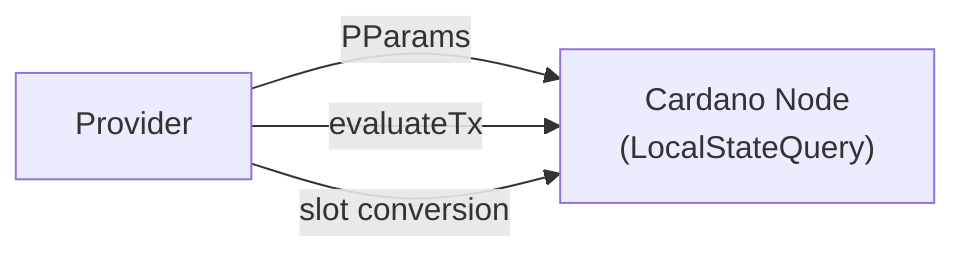
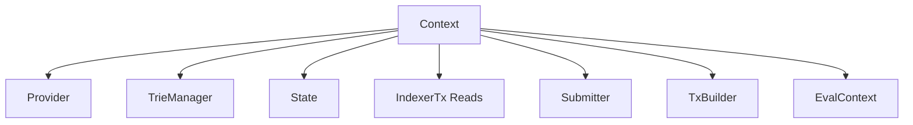

# Singletons

Every major component is a **record of functions**, polymorphic in
the monad `m`. No typeclasses are used — dependencies are explicit
and passed as values. This makes testing trivial: swap a record for
a mock.

## Provider

Ledger metadata queries. The real implementation uses N2C
LocalStateQuery for protocol parameters, script evaluation, and
POSIX/slot conversion. `queryUTxOs` still exists in the low-level
record, but it is forbidden on server-side proof/write hot paths:
production UTxO facts come from the local indexer's CSMT through
`Context.runIndexerTx`.

**Implementation:** [`mkNodeClientProvider`](https://github.com/lambdasistemi/cardano-mpfs-offchain/search?q=mkNodeClientProvider&type=code) (real N2C, in [`Provider.NodeClient`](https://github.com/lambdasistemi/cardano-mpfs-offchain/search?q=%22module+Cardano.MPFS.Provider.NodeClient%22&type=code))

```haskell
data Provider m = Provider
    { queryUTxOs
        :: Addr
        -> m [(TxIn, TxOut ConwayEra)]
    -- ^ Low-level LSQ address query. Forbidden on
    -- proof/write hot paths.
    , queryProtocolParams
        :: m (PParams ConwayEra)
    -- ^ Fetch current protocol parameters
    , evaluateTx
        :: ConwayTx -> m (EvaluateTxResult ConwayEra)
    -- ^ Evaluate script execution units
    , posixMsToSlot :: Integer -> m SlotNo
    -- ^ Convert POSIX time (ms) to slot (floor)
    , posixMsCeilSlot :: Integer -> m SlotNo
    -- ^ Convert POSIX time (ms) to slot (ceiling)
    }
```



`GET /eval-context` is exposed through the top-level `Context`, not the
`Provider` record itself. It returns trusted interim PlutusV3 evaluation
metadata: protocol parameters/cost models, `SystemStart`, epoch size,
slot length, and live era history.

---

## TrieManager

Manages a map of token identifiers to MPF tries. Each token has
its own isolated trie, sharing the same RocksDB column families
with per-token `HexKey` prefix scoping.

**Transactional:** [`mkUnifiedTrieManager`](https://github.com/lambdasistemi/cardano-mpfs-offchain/search?q=mkUnifiedTrieManager&type=code) — composes into the caller's `Transaction` (used by `CageFollower` for atomic block processing)
**IO:** [`mkPersistentTrieManager`](https://github.com/lambdasistemi/cardano-mpfs-offchain/search?q=mkPersistentTrieManager&type=code) — auto-commits + IORef caches (used by `TxBuilder` and speculative sessions)
**Test:** [`mkPureTrieManager`](https://github.com/lambdasistemi/cardano-mpfs-offchain/search?q=mkPureTrieManager&type=code) — in-memory (in [`Trie.PureManager`](https://github.com/lambdasistemi/cardano-mpfs-offchain/search?q=%22module+Cardano.MPFS.Trie.PureManager%22&type=code))

```haskell
data TrieManager m = TrieManager
    { withTrie
        :: forall a
         . TokenId
        -> (Trie m -> m a)
        -> m a
    -- ^ Run an action with access to a token's trie
    , withSpeculativeTrie
        :: forall a
         . TokenId
        -> (forall n. Monad n => Trie n -> n a)
        -> m a
    -- ^ Run read-your-writes trie mutations and
    -- discard them at the end
    , createTrie :: TokenId -> m ()
    -- ^ Create a new empty trie for a token
    , deleteTrie :: TokenId -> m ()
    -- ^ Delete a token's trie
    , hideTrie :: TokenId -> m ()
    -- ^ Hide a burned trie while preserving data
    , unhideTrie :: TokenId -> m ()
    -- ^ Restore a hidden trie during rollback
    }

data Trie m = Trie
    { insert
        :: ByteString -> ByteString -> m Root
    , delete :: ByteString -> m Root
    , lookup :: ByteString -> m (Maybe ByteString)
    , enumerate :: m [(ByteString, ByteString)]
    , getRoot :: m Root
    , getProof :: ByteString -> m (Maybe Proof)
    , getProofSteps :: ByteString -> m (Maybe [ProofStep])
    }
```

---

## State

Token and request state tracking. Three sub-records for tokens,
requests, and chain sync checkpoints.

**Transactional:** [`mkTransactionalState`](https://github.com/lambdasistemi/cardano-mpfs-offchain/search?q=mkTransactionalState&type=code) — composes into the caller's `Transaction` (used by `CageFollower`)
**IO:** [`mkPersistentState`](https://github.com/lambdasistemi/cardano-mpfs-offchain/search?q=mkPersistentState&type=code) — auto-commits via `hoistState` (in [`Indexer.Persistent`](https://github.com/lambdasistemi/cardano-mpfs-offchain/search?q=%22module+Cardano.MPFS.Indexer.Persistent%22&type=code))
**Test:** [`mkMockState`](https://github.com/lambdasistemi/cardano-mpfs-offchain/search?q=mkMockState&type=code) — in-memory (in [`Mock.State`](https://github.com/lambdasistemi/cardano-mpfs-offchain/search?q=%22module+Cardano.MPFS.Mock.State%22&type=code))

```haskell
data State m = State
    { tokens :: Tokens m
    , requests :: Requests m
    , checkpoints :: Checkpoints m
    }

data Tokens m = Tokens
    { getToken :: TokenId -> m (Maybe LocatedTokenState)
    , putToken :: TokenId -> LocatedTokenState -> m ()
    , removeToken :: TokenId -> m ()
    , listTokens :: m [TokenId]
    }

data Requests m = Requests
    { getRequest :: TxIn -> m (Maybe LocatedRequest)
    , putRequest :: LocatedRequest -> m ()
    , removeRequest :: TxIn -> m ()
    , requestsByToken :: TokenId -> m [LocatedRequest]
    }

data Checkpoints m = Checkpoints
    { getCheckpoint :: m (Maybe (SlotNo, BlockId))
    , putCheckpoint :: SlotNo -> BlockId -> m ()
    }
```

---

## Indexer Reads And Follower

The ChainSync follower is now wired by `Application` rather than exposed
as an `Indexer` field on `Context`. Its operational role is still the
same: `CageFollower` processes every block in a [single atomic
transaction](block-processing.md) covering UTxO CSMT, cage state, MPF
tries, and rollback data.

Proof-bearing HTTP handlers use composable read primitives from
`Indexer.Reads` and discharge them through one `Context` field:

```haskell
runIndexerTx :: forall a. IndexerTx a -> m a
```

That field is the fact-provider boundary. A handler composes snapshot,
wallet input, state UTxO, request-set, and MPF reads, then runs the
composition in one underlying transaction so the emitted witnesses all
target the same indexed `utxo_root`.

---

## Submitter

Transaction submission via N2C LocalTxSubmission. Takes a full
ledger `Tx ConwayEra` and returns a `SubmitResult`.

**Implementation:** [`mkN2CSubmitter`](https://github.com/lambdasistemi/cardano-mpfs-offchain/search?q=mkN2CSubmitter&type=code) (real N2C, in [`Submitter.N2C`](https://github.com/lambdasistemi/cardano-mpfs-offchain/search?q=%22module+Cardano.MPFS.Submitter.N2C%22&type=code))

```haskell
data SubmitResult
    = Submitted TxId
    | Rejected ByteString

newtype Submitter m = Submitter
    { submitTx :: Tx ConwayEra -> m SubmitResult
    }
```

---

## TxBuilder

Internal server transaction builders. They return proof envelopes around
unsigned ledger transactions and consume a caller-supplied
`BundleSnapshot`; they must not query the node for UTxO state. Public
script-bearing browser flows use facts endpoints plus
`cardano-mpfs-cage-tx` instead of asking the server to return unsigned
transactions.

**Mock:** [`mkMockTxBuilder`](https://github.com/lambdasistemi/cardano-mpfs-offchain/search?q=mkMockTxBuilder&type=code) (in [`Mock.TxBuilder`](https://github.com/lambdasistemi/cardano-mpfs-offchain/search?q=%22module+Cardano.MPFS.Mock.TxBuilder%22&type=code))
**Real:** [`mkRealTxBuilder`](https://github.com/lambdasistemi/cardano-mpfs-offchain/search?q=mkRealTxBuilder&type=code) (in [`TxBuilder.Real`](https://github.com/lambdasistemi/cardano-mpfs-offchain/search?q=%22module+Cardano.MPFS.TxBuilder.Real%22+path%3AReal.hs&type=code))

```haskell
data TxBuilder m = TxBuilder
    { bootToken
        :: BundleSnapshot
        -> [ResolvedWalletInput]
        -> Addr
        -> m (ProofEnvelope BootProof)
    -- ^ Create a new MPFS token
    , requestInsert
        :: BundleSnapshot
        -> TokenId -> ByteString -> ByteString
        -> Addr -> m (ProofEnvelope RequestProof)
    -- ^ Request inserting a key-value pair
    , requestDelete
        :: BundleSnapshot
        -> TokenId -> ByteString -> ByteString
        -> Addr -> m (ProofEnvelope RequestProof)
    -- ^ Request deleting a key
    , requestUpdate
        :: BundleSnapshot
        -> TokenId -> ByteString -> ByteString -> ByteString
        -> Addr -> m (ProofEnvelope RequestProof)
    -- ^ Request updating a key
    , updateToken
        :: BundleSnapshot
        -> TokenId -> Addr -> m (ProofEnvelope UpdateProof)
    -- ^ Process pending requests for a token
    , retractRequest
        :: BundleSnapshot
        -> TxIn -> Addr -> m (ProofEnvelope RetractProof)
    -- ^ Cancel a pending request
    , rejectRequests
        :: BundleSnapshot
        -> TokenId -> Addr -> m (ProofEnvelope RejectProof)
    -- ^ Reject Phase 3 requests
    , endToken
        :: BundleSnapshot
        -> TokenId -> Addr -> m (ProofEnvelope EndProof)
    -- ^ Retire an MPFS token
    }
```

---

## Evaluation And Balance

Transaction construction uses ledger-native balancing helpers in
`TxBuilder.Real.Internal` on the server side and
`Cardano.MPFS.Client.Cage.Eval` in `cardano-mpfs-cage-tx` on the
client/reactor side. The `*WithEval` cage APIs first decode
`GET /eval-context`, derive `EpochInfo` from the live era history, and
then evaluate/balance transactions with real ex-units before wallet
signing.

```haskell
bootCageTxWithEval
    :: DecodedEvalContext
    -> CageConfig
    -> WalletPolicy
    -> VerifiedBootFacts
    -> Either BuildError ConwayTx
```

Update, retract, reject, end, and boot are eval-only because they carry
scripts and must use current PlutusV3 cost models and era history.
Request insert/delete/update builders do not run scripts, but they still
consume verified facts and the same cage configuration.

---

## Context

Facade record that bundles all singletons into a single environment.

```haskell
data Context m = Context
    { provider :: Provider m
    , trieManager :: TrieManager m
    , state :: State m
    , submitter :: Submitter m
    , txBuilder :: TxBuilder m
    , cfgCage :: CageConfig
    , utxoExists :: TxIn -> m Bool
    , resolveUtxo :: TxIn -> m (Maybe ByteString)
    , awaitUtxo :: TxIn -> Maybe Int -> m (Maybe ByteString)
    , utxoRoot :: m (Maybe ByteString)
    , utxoProof :: TxIn -> m (Maybe ByteString)
    , indexerProofsReady :: m Bool
    , evalContext :: m EvalContext
    , runIndexerTx :: forall a. IndexerTx a -> m a
    , readMetrics :: m (Maybe Metrics)
    }
```



### HTTP Server

[`mkApp`](https://github.com/lambdasistemi/cardano-mpfs-offchain/search?q=mkApp+path%3AHTTP&type=code)
from [`HTTP.Server`](https://github.com/lambdasistemi/cardano-mpfs-offchain/search?q=%22module+Cardano.MPFS.HTTP.Server%22&type=code)
wraps a `Context IO` into a WAI `Application` with Swagger UI
at `/swagger-ui`. Each HTTP handler extracts the relevant
interface from `Context` and delegates to it.
